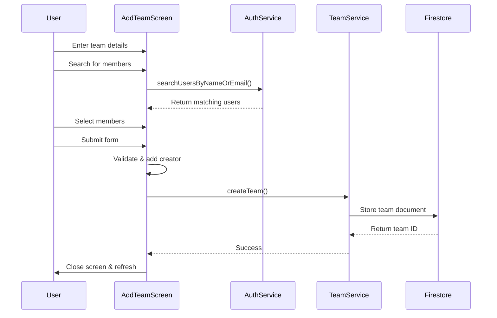

## Overview

The `AddTeamScreen` provides an interface for creating new teams with customizable properties including name, description, color, and initial member selection.

**File**: `lib/ui/screens/add_team_screen.dart`

## Purpose

Enables users to:
- Create new teams with custom names and descriptions
- Select team colors for visual organization
- Search and add initial team members
- Automatically include the creator as a team member

## Key Components

### State Variables

<ParamField path="_authService" type="AuthService">
  Service for user search functionality
</ParamField>

<ParamField path="_teamService" type="TeamService">
  Service for team creation operations
</ParamField>

<ParamField path="_searchResults" type="List<UserProfile>">
  List of users matching search query
</ParamField>

<ParamField path="_searchQuery" type="String">
  Current search query for finding users
</ParamField>

<ParamField path="_teamName" type="String">
  Name of the team being created
</ParamField>

<ParamField path="_projectDescription" type="String">
  Description of the team/project
</ParamField>

<ParamField path="_selectedColor" type="Color">
  Selected color for the team (default: blue)
</ParamField>

<ParamField path="_selectedMembers" type="List<UserProfile>">
  List of members selected to join the team
</ParamField>

## Key Methods

### _searchUsers()

Searches for users by name or email:

```dart lib/ui/screens/add_team_screen.dart:28
void _searchUsers() async {
  if (_searchQuery.isNotEmpty) {
    final results = await _authService.searchUsersByNameOrEmail(_searchQuery);
    setState(() {
      _searchResults = results;
    });
  } else {
    setState(() {
      _searchResults = [];
    });
  }
}
```

### _createTeam()

Creates the team with selected configuration:

```dart lib/ui/screens/add_team_screen.dart:42
Future<void> _createTeam() async {
  if (_teamName.isNotEmpty && _projectDescription.isNotEmpty) {
    try {
      User? currentUser = FirebaseAuth.instance.currentUser;
      if (currentUser != null) {
        List<String> allMembers =
            _selectedMembers.map((member) => member.uid).toList();

        // Ensure current user is included
        if (!allMembers.contains(currentUser.uid)) {
          allMembers.add(currentUser.uid);
        }

        final teamId = await _teamService.createTeam(
          _teamName,
          _projectDescription,
          _selectedColor,
          allMembers,
        );

        if (teamId != null) {
          if (mounted) {
            Navigator.pop(context, true);
          }
        }
      }
    } catch (e) {
      _logger.e('Error creating team: $e');
      if (mounted) {
        ScaffoldMessenger.of(context).showSnackBar(
          const SnackBar(content: Text('Error al crear el equipo')),
        );
      }
    }
  }
}
```

### _selectColor()

Updates the selected team color:

```dart lib/ui/screens/add_team_screen.dart:89
void _selectColor(Color color) {
  setState(() {
    _selectedColor = color;
  });
}
```

### _addMemberToTeam()

Adds a user to the selected members list:

```dart lib/ui/screens/add_team_screen.dart:96
void _addMemberToTeam(UserProfile user) {
  setState(() {
    if (!_selectedMembers.contains(user)) {
      _selectedMembers.add(user);
    }
  });
}
```

## UI Structure

### Team Configuration Section

1. **Team Name Input** - Required text field for team name
2. **Project Description** - Required text field for team description
3. **Color Picker** - Visual color selection grid

### Member Search Section

1. **Search Bar** - TextField for searching users by name or email
2. **Search Results** - ListView displaying matching users
3. **Selected Members** - Chips showing currently selected members

### Available Colors

Predefined color options:
- Blue
- Green
- Red
- Orange
- Purple
- Pink
- Yellow
- Brown

## Data Flow



## Validation

### Required Fields

- **Team Name**: Must not be empty
- **Project Description**: Must not be empty

### Auto-corrections

- Current user automatically added to members list if not already included
- Prevents duplicate member additions

## Team Data Structure

Teams are created with the following Firestore structure:

```json
{
  "name": "Team Name",
  "description": "Project description",
  "color": 4280391411, // Color value
  "members": ["uid1", "uid2", "uid3"],
  "userId": "creator_uid",
  "createdAt": Timestamp
}
```

## Error Handling

- Empty field validation with SnackBar messages
- Team creation errors logged and displayed
- Network errors handled gracefully
- Mounted checks before navigation and UI updates

## Best Practices

1. **Always Include Creator**: Ensure the team creator is in the members list
2. **Validate Before Submit**: Check all required fields
3. **Clear Search**: Reset search results when query is empty
4. **User Feedback**: Show loading indicators and error messages
5. **Return Status**: Pass `true` back to caller on successful creation

## Related Components

<CardGroup cols={2}>
  <Card title="TeamService" icon="users" href="/api/team-service">
    Service handling team creation
  </Card>
  <Card title="AuthService" icon="shield" href="/api/auth-service">
    Service providing user search
  </Card>
  <Card title="TaskScreen" icon="list" href="/api/task-screen">
    Main screen showing created teams
  </Card>
  <Card title="Team Management" icon="people-group" href="/features/team-management">
    Team management feature documentation
  </Card>
</CardGroup>
