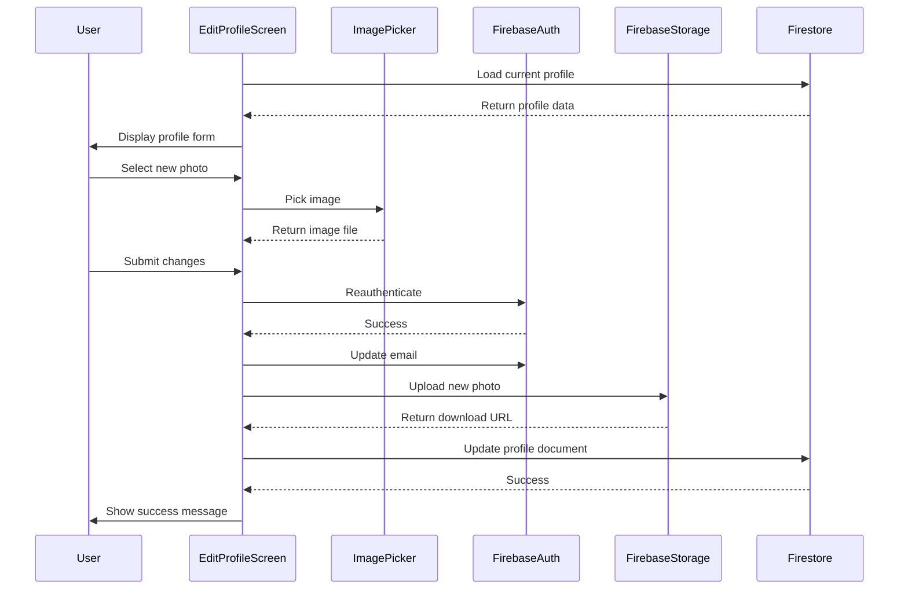

## Overview

The `EditProfileScreen` allows users to update their profile information including name, surname, email, password, and profile photo.

**File**: `lib/ui/screens/edit_profile_screen.dart`

## Purpose

Provides functionality to:
- View current profile information
- Update name and surname
- Change email address
- Update password with reauthentication
- Upload or change profile photo
- Store updated data in Firestore and Firebase Auth

## Key Components

### State Variables

<ParamField path="_auth" type="FirebaseAuth">
  Firebase Auth instance for authentication operations
</ParamField>

<ParamField path="_firestore" type="FirebaseFirestore">
  Firestore instance for profile data storage
</ParamField>

<ParamField path="_storage" type="FirebaseStorage">
  Firebase Storage for profile image uploads
</ParamField>

<ParamField path="_nameController" type="TextEditingController">
  Controls the name input field
</ParamField>

<ParamField path="_surnameController" type="TextEditingController">
  Controls the surname input field
</ParamField>

<ParamField path="_emailController" type="TextEditingController">
  Controls the email input field
</ParamField>

<ParamField path="_passwordController" type="TextEditingController">
  Controls the password input field (for reauthentication)
</ParamField>

<ParamField path="_photoUrl" type="String?">
  Current profile photo URL from Firebase Storage
</ParamField>

<ParamField path="_profileImage" type="File?">
  Newly selected profile image file
</ParamField>

## Key Methods

### _loadUserData()

Loads current user profile data on initialization:

```dart lib/ui/screens/edit_profile_screen.dart:38
void _loadUserData() async {
  User? user = _auth.currentUser;
  if (user != null) {
    DocumentSnapshot userProfile =
        await _firestore.collection('users').doc(user.uid).get();
    _nameController.text = userProfile['name'] ?? '';
    _surnameController.text = userProfile['surname'] ?? '';
    _emailController.text = user.email ?? '';
    
    final data = userProfile.data() as Map<String, dynamic>?;
    if (data != null && data.containsKey('photoUrl')) {
      _photoUrl = data['photoUrl'];
    }
    
    setState(() {});
  }
}
```

### _pickImage()

Allows user to select a new profile photo from gallery:

```dart lib/ui/screens/edit_profile_screen.dart:58
Future<void> _pickImage() async {
  final picker = ImagePicker();
  final pickedFile = await picker.pickImage(source: ImageSource.gallery);
  if (pickedFile != null) {
    setState(() {
      _profileImage = File(pickedFile.path);
    });
  }
}
```

### _updateProfile()

Handles the complete profile update process:

1. **Reauthentication** (if password provided)
2. **Email Update** (if changed)
3. **Profile Image Upload** (if new image selected)
4. **Firestore Update** (name, surname, photoUrl)

```dart lib/ui/screens/edit_profile_screen.dart:68
void _updateProfile() async {
  User? user = _auth.currentUser;
  if (user != null) {
    try {
      // Reauthentication if password provided
      if (_passwordController.text.isNotEmpty) {
        final credential = EmailAuthProvider.credential(
          email: user.email!,
          password: _passwordController.text,
        );
        await user.reauthenticateWithCredential(credential);
      }

      // Update email if changed
      if (_emailController.text != user.email) {
        await user.updateEmail(_emailController.text);
      }

      // Upload new profile image if selected
      if (_profileImage != null) {
        final storageRef = _storage.ref().child('profile_images/${user.uid}');
        await storageRef.putFile(_profileImage!);
        _photoUrl = await storageRef.getDownloadURL();
      }

      // Update Firestore document
      await _firestore.collection('users').doc(user.uid).update({
        'name': _nameController.text,
        'surname': _surnameController.text,
        'photoUrl': _photoUrl,
      });

      if (mounted) {
        ScaffoldMessenger.of(context).showSnackBar(
          const SnackBar(content: Text('Perfil actualizado exitosamente')),
        );
      }
    } catch (e) {
      logger.e('Error updating profile: $e');
      if (mounted) {
        ScaffoldMessenger.of(context).showSnackBar(
          SnackBar(content: Text('Error: $e')),
        );
      }
    }
  }
}
```

## UI Structure

### Profile Photo Section

- **Current Photo Display** - CircleAvatar showing existing photo or placeholder
- **Change Photo Button** - Opens image picker gallery
- **Image Preview** - Shows newly selected image before upload

### Form Fields

1. **Name Field** - TextFormField with current name
2. **Surname Field** - TextFormField with current surname
3. **Email Field** - TextFormField with current email (requires reauthentication to change)
4. **Password Field** - Optional field for reauthentication

### Actions

- **Save Button** - Submits profile updates
- **Cancel/Back Button** - Returns without saving

## Data Flow



## Profile Image Storage

### Storage Path

Profile images are stored at:

```
profile_images/{userId}
```

### Upload Process

1. User selects image from gallery
2. Image stored temporarily as File object
3. On save, image uploaded to Firebase Storage
4. Download URL retrieved and stored in Firestore
5. Old image automatically replaced (same path)

## Security Considerations

### Reauthentication

Required for sensitive operations:
- Changing email address
- Updating password

```dart
final credential = EmailAuthProvider.credential(
  email: user.email!,
  password: _passwordController.text,
);
await user.reauthenticateWithCredential(credential);
```

### Error Handling

- **Invalid credentials**: Shows error message
- **Network errors**: Gracefully handled with user feedback
- **Upload failures**: Reverted with error notification
- **Email already in use**: Firebase error displayed

## Best Practices

1. **Always Reauthenticate**: Before sensitive operations like email change
2. **Validate Email Format**: Ensure valid email before submission
3. **Compress Images**: Consider image optimization before upload
4. **Handle Mounted State**: Check widget mounted before UI updates
5. **Clear Password Field**: Don't persist password in controller
6. **Show Loading State**: Display progress during upload/update

## Validation Rules

- **Name**: Required, non-empty
- **Surname**: Required, non-empty
- **Email**: Valid email format required
- **Password**: Required for email changes, minimum 6 characters
- **Photo**: Optional, supports common image formats

## Related Components

<CardGroup cols={2}>
  <Card title="User Profiles" icon="user" href="/features/user-profiles">
    User profile feature documentation
  </Card>
  <Card title="Firebase Storage" icon="database" href="/config/storage">
    Storage configuration guide
  </Card>
  <Card title="Authentication" icon="shield" href="/features/authentication">
    Authentication feature overview
  </Card>
  <Card title="TaskScreen" icon="list" href="/api/task-screen">
    Main dashboard with profile access
  </Card>
</CardGroup>
