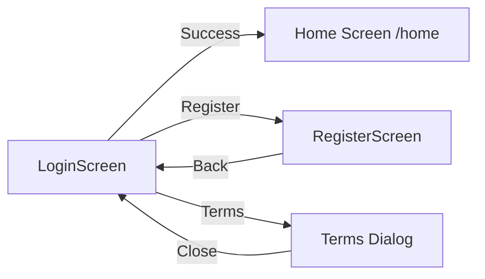

## Screen Overview

The `LoginScreen` provides user authentication functionality with support for both email/password login and Google Sign-In. It includes terms and conditions acceptance and navigation to the registration screen.

**Location:** `lib/ui/screens/login_screen.dart`

## Purpose

The LoginScreen serves as the entry point to the application, providing:
- Email and password authentication
- Google Sign-In integration
- Terms and conditions acceptance
- Navigation to user registration
- Form validation and error handling

## State Management

### State Variables

<ParamField path="_authService" type="AuthService">
  Instance of the authentication service that handles sign-in operations.
</ParamField>

<ParamField path="_emailController" type="TextEditingController">
  Controller for the email input field.
</ParamField>

<ParamField path="_passwordController" type="TextEditingController">
  Controller for the password input field.
</ParamField>

<ParamField path="_acceptedTerms" type="bool">
  Boolean flag indicating whether the user has accepted the terms and conditions. Initially `false`.
</ParamField>

## Authentication Methods

### Email/Password Login

```dart
void _loginWithEmail()
```

Authenticates users using email and password credentials. Located at `login_screen.dart:19`.

**Process:**
1. Trims email and password input
2. Calls `_authService.signInWithEmailAndPassword()`
3. On success: Navigates to `/home` route
4. On failure: Shows error SnackBar

**Error Handling:**
- Validates widget is still mounted before navigation
- Displays "Inicio de sesión fallido. Verifica tus credenciales." on error

### Google Sign-In

```dart
void _loginWithGoogle()
```

Authenticates users through Google Sign-In. Located at `login_screen.dart:37`.

**Process:**
1. Calls `_authService.signInWithGoogle()`
2. On success: Navigates to `/home` route
3. On failure: Shows error SnackBar

**Error Handling:**
- Validates widget is still mounted before navigation
- Displays "Error al iniciar sesión con Google." on error

## Form Components

### Email Input Field

<ParamField path="Email Field" type="TextField">
  - Label: "Ingrese correo electrónico"
  - Input type: `TextInputType.emailAddress`
  - Border: Rounded (30.0 radius)
  - Color scheme: Gray (#C9C9CA)
</ParamField>

Located at `login_screen.dart:70-83`.

### Password Input Field

<ParamField path="Password Field" type="TextField">
  - Label: "Contraseña"
  - Obscured text: `true`
  - Border: Rounded (30.0 radius)
  - Color scheme: Gray (#C9C9CA)
</ParamField>

Located at `login_screen.dart:85-97`.

### Terms and Conditions Checkbox

<ParamField path="Terms Checkbox" type="Checkbox">
  - Label: "Acepto Términos y Condiciones" (clickable)
  - Active color: Light gray (#E6E6E6)
  - Check color: Green (#6BCE81)
  - Tapping label opens terms dialog
</ParamField>

Located at `login_screen.dart:99-127`.

## Buttons

### Login Button

```dart
ElevatedButton(
  onPressed: _acceptedTerms ? _loginWithEmail : null,
  // ...
)
```

- **State**: Disabled unless terms are accepted
- **Background**: Teal (#B7F6E3)
- **Border**: Yellow (#FFEE93, 2px)
- **Text**: "Iniciar"
- **Size**: 200x50 minimum

Located at `login_screen.dart:129-147`.

### Google Sign-In Button

- **Background**: Teal (#089B83)
- **Text**: "Iniciar sesión con Google"
- **Always enabled** (no terms requirement)

Located at `login_screen.dart:154-160`.

### Register Navigation

```dart
TextButton(
  onPressed: () {
    Navigator.push(
      context,
      MaterialPageRoute(builder: (context) => const RegisterScreen()),
    );
  },
  // ...
)
```

Displays: "¿No tienes una cuenta? **Regístrate**"
- First part: Gray (#C9C9CA)
- "Regístrate": Dark green (#0D4533)

Located at `login_screen.dart:161-183`.

## Terms and Conditions Dialog

### Dialog Function

```dart
void _showTermsAndConditions(BuildContext context)
```

Displays a custom dialog with terms and conditions content. Located at `login_screen.dart:194`.

### Dialog Structure

<CardGroup cols={2}>
  <Card title="Header" icon="heading">
    - Title: "Términos y Condiciones"
    - Close button (circular, top-right)
  </Card>
  <Card title="Content" icon="file-lines">
    - Effective date: "02 de Octubre de 2024"
    - Welcome message
    - Section 1: Acceptance of Terms
  </Card>
</CardGroup>

**Styling:**
- Rounded corners (20.0 radius)
- Max width: 350px
- Close button: Green circular border (#97CE6B)
- Scrollable content for long terms

## Layout Structure

```
Scaffold
└── SingleChildScrollView
    └── Center
        └── Padding
            └── Container (max width: 400)
                └── Column
                    ├── Image (sunshine.png, 280px)
                    ├── TextField (email)
                    ├── TextField (password)
                    ├── Row
                    │   ├── Checkbox
                    │   └── Text (terms link)
                    ├── ElevatedButton (login)
                    ├── Text (Google prompt)
                    ├── ElevatedButton (Google)
                    └── TextButton (register link)
```

## Form Validation

### Input Validation

- **Email**: Uses `.trim()` to remove whitespace
- **Password**: Uses `.trim()` to remove whitespace
- **Terms**: Must be accepted before email/password login

<Warning>
  The login button is **disabled** when `_acceptedTerms` is `false`. Users must check the checkbox to proceed with email/password authentication.
</Warning>

### Error Messages

Error messages are displayed using `ScaffoldMessenger.showSnackBar()`:

<CodeGroup>
```dart Email/Password Error
ScaffoldMessenger.of(context).showSnackBar(
  const SnackBar(
    content: Text('Inicio de sesión fallido. Verifica tus credenciales.')
  ),
);
```

```dart Google Sign-In Error
ScaffoldMessenger.of(context).showSnackBar(
  const SnackBar(
    content: Text('Error al iniciar sesión con Google.')
  ),
);
```
</CodeGroup>

## Navigation Flow



## Screen Features

<AccordionGroup>
  <Accordion title="Responsive Design">
    - `SingleChildScrollView` prevents overflow on small screens
    - Container max-width constraint (400px) for larger screens
    - Centered layout for better appearance
  </Accordion>

  <Accordion title="Accessibility">
    - Proper keyboard types (email, password)
    - Visible labels on all inputs
    - Clear error messaging
    - Touch-friendly button sizes
  </Accordion>

  <Accordion title="UX Considerations">
    - Visual branding with sunshine logo
    - Disabled state for login button (requires terms acceptance)
    - Separate Google Sign-In option (no terms requirement)
    - Clear path to registration
  </Accordion>
</AccordionGroup>

## Color Scheme

| Element | Color Code | Description |
|---------|------------|-------------|
| Background | `#FFFFFF` | White |
| Input borders | `#C9C9CA` | Light gray |
| Login button bg | `#B7F6E3` | Teal |
| Login button border | `#FFEE93` | Yellow |
| Google button bg | `#089B83` | Dark teal |
| Terms checkbox | `#6BCE81` | Green |
| Register link | `#0D4533` | Dark green |

## Best Practices

<Check>Uses `mounted` check before navigation to prevent memory leaks</Check>
<Check>Trims user input to avoid whitespace issues</Check>
<Check>Separates authentication logic into `AuthService`</Check>
<Check>Provides clear user feedback with SnackBars</Check>
<Check>Implements proper error handling for async operations</Check>