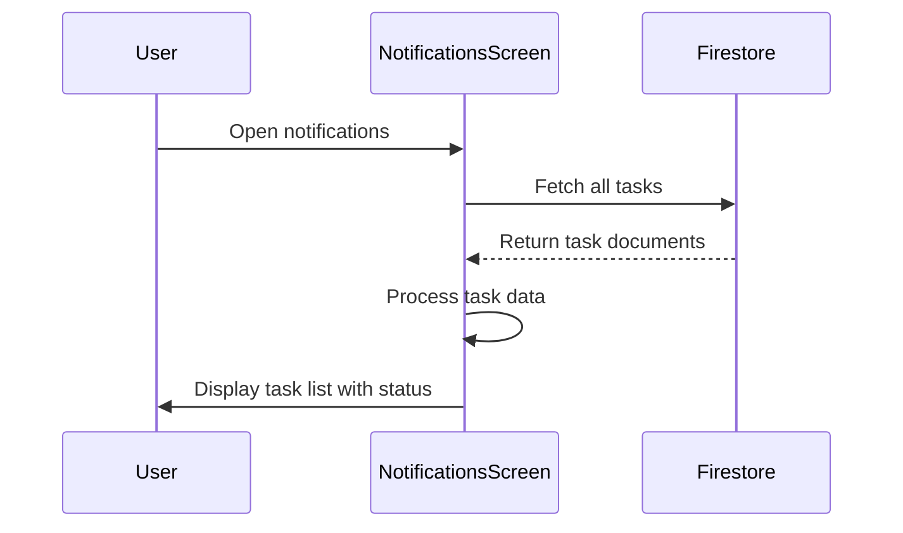

## Overview

The `NotificationsScreen` displays a list of all tasks with their completion status, serving as a notification center for task updates.

**File**: `lib/ui/screens/notifications_screen.dart`

## Purpose

Provides a centralized view where users can:
- See all tasks across teams
- View task completion status at a glance
- Monitor task progress
- Access task notifications

## Key Components

### State Variables

<ParamField path="_firestore" type="FirebaseFirestore">
  Firestore instance for fetching task data
</ParamField>

<ParamField path="_tasks" type="List<Map<String, dynamic>>">
  List of all tasks with their details and completion status
</ParamField>

## Key Methods

### initState()

Initializes the screen by fetching all tasks:

```dart lib/ui/screens/notifications_screen.dart:16
@override
void initState() {
  super.initState();
  _fetchTasks();
}
```

### _fetchTasks()

Retrieves all tasks from Firestore:

```dart lib/ui/screens/notifications_screen.dart:21
Future<void> _fetchTasks() async {
  try {
    final snapshot = await _firestore.collection('tasks').get();
    setState(() {
      _tasks = snapshot.docs.map((doc) {
        return {
          'id': doc.id,
          'name': doc['name'],
          'description': doc['description'],
          'isCompleted': doc['isCompleted'] ?? false,
        };
      }).toList();
    });
  } catch (e) {
    // Error handling
  }
}
```

## UI Structure

### AppBar

- **Title**: "Notificaciones" (Notifications)
- **Back Button**: Returns to previous screen

### Task List

Displays all tasks in a ListView with:
- **Task Name** - Title of the task
- **Task Description** - Brief description or details
- **Completion Icon** - Visual indicator:
  - Green checkmark for completed tasks
  - Red pending icon for incomplete tasks

## Task Data Structure

Each task contains:

<ResponseField name="id" type="string">
  Unique task identifier from Firestore
</ResponseField>

<ResponseField name="name" type="string">
  Display name of the task
</ResponseField>

<ResponseField name="description" type="string">
  Detailed description of the task
</ResponseField>

<ResponseField name="isCompleted" type="boolean">
  Task completion status (defaults to false if not set)
</ResponseField>

## Data Flow



## Visual Indicators

### Completion Status Icons

**Completed Tasks**:
- Icon: `Icons.check`
- Color: Green (`Colors.green`)
- Indicates task is finished

**Pending Tasks**:
- Icon: `Icons.pending`
- Color: Red (`Colors.red`)
- Indicates task needs attention

## ListTile Structure

Each task is displayed as:

```dart
ListTile(
  title: Text(task['name']),
  subtitle: Text(task['description']),
  trailing: Icon(
    task['isCompleted'] ? Icons.check : Icons.pending,
    color: task['isCompleted'] ? Colors.green : Colors.red,
  ),
)
```

## Error Handling

- **Fetch Errors**: Silently handled, empty list shown
- **Missing Fields**: Default values applied
- **Network Issues**: Graceful degradation

## Future Enhancements

Potential improvements:

1. **Real-time Updates**: Convert to StreamBuilder for live updates
2. **Filtering**: Add filters for completed/pending tasks
3. **Sorting**: Sort by date, priority, or status
4. **Notifications**: Integrate with `flutter_local_notifications`
5. **Task Actions**: Add quick actions (complete, dismiss, etc.)
6. **Push Notifications**: Firebase Cloud Messaging integration
7. **Unread Indicators**: Show new/unread notifications
8. **Time-based Alerts**: Deadline reminders

## Integration with flutter_local_notifications

The app includes `flutter_local_notifications` dependency for local notification support. This screen can be enhanced to:

- Schedule task deadline reminders
- Send notifications for task assignments
- Alert on task status changes
- Provide daily task summaries

### Example Notification Setup

```dart
import 'package:flutter_local_notifications/flutter_local_notifications.dart';

final FlutterLocalNotificationsPlugin flutterLocalNotificationsPlugin =
    FlutterLocalNotificationsPlugin();

// Initialize
const AndroidInitializationSettings initializationSettingsAndroid =
    AndroidInitializationSettings('@mipmap/ic_launcher');

const InitializationSettings initializationSettings =
    InitializationSettings(android: initializationSettingsAndroid);

await flutterLocalNotificationsPlugin.initialize(initializationSettings);

// Show notification
const AndroidNotificationDetails androidDetails =
    AndroidNotificationDetails(
  'task_channel',
  'Task Notifications',
  importance: Importance.high,
  priority: Priority.high,
);

const NotificationDetails notificationDetails =
    NotificationDetails(android: androidDetails);

await flutterLocalNotificationsPlugin.show(
  0,
  'Task Reminder',
  'You have 5 pending tasks',
  notificationDetails,
);
```

## Best Practices

1. **Use Streams**: Consider StreamBuilder for real-time updates
2. **Pagination**: Implement for large task lists
3. **Error Display**: Show user-friendly error messages
4. **Empty State**: Add meaningful empty state UI
5. **Loading State**: Display progress indicator during fetch
6. **Task Details**: Make tasks tappable for full details
7. **Refresh**: Add pull-to-refresh functionality

## Performance Considerations

- Currently fetches all tasks (may be slow for large datasets)
- Consider pagination or lazy loading
- Add query limits for initial load
- Implement caching for offline access
- Use composite indexes for filtered queries

## Related Components

<CardGroup cols={2}>
  <Card title="Notifications Guide" icon="bell" href="/guides/notifications">
    User guide for notification features
  </Card>
  <Card title="TaskScreen" icon="list" href="/api/task-screen">
    Main task dashboard
  </Card>
  <Card title="UserTaskScreen" icon="user" href="/api/user-task-screen">
    Individual user task view
  </Card>
  <Card title="Task Management" icon="tasks" href="/features/task-management">
    Task management feature overview
  </Card>
</CardGroup>
