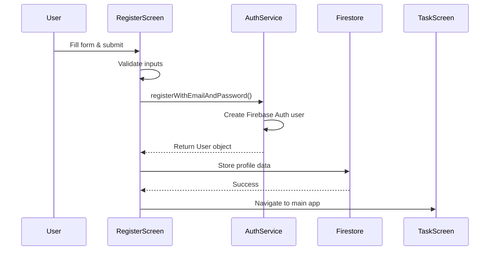

## Overview

The `RegisterScreen` provides a complete user registration interface where new users can create an account with email/password authentication and set up their initial profile.

**File**: `lib/ui/screens/register_screen.dart`

## Purpose

Handles new user registration flow including:
- Email and password account creation
- Profile information collection (name, surname)
- Optional profile photo upload
- Profile data storage in Firestore
- Navigation to main app after successful registration

## Key Components

### State Variables

<ParamField path="_authService" type="AuthService">
  Instance of AuthService for authentication operations
</ParamField>

<ParamField path="_firestore" type="FirebaseFirestore">
  Firestore instance for storing user profile data
</ParamField>

<ParamField path="_nameController" type="TextEditingController">
  Controls the name input field
</ParamField>

<ParamField path="_surnameController" type="TextEditingController">
  Controls the surname input field
</ParamField>

<ParamField path="_emailController" type="TextEditingController">
  Controls the email input field
</ParamField>

<ParamField path="_passwordController" type="TextEditingController">
  Controls the password input field
</ParamField>

<ParamField path="_confirmPasswordController" type="TextEditingController">
  Controls the password confirmation field
</ParamField>

<ParamField path="_profileImage" type="File?">
  Stores the selected profile image file
</ParamField>

<ParamField path="_formKey" type="GlobalKey<FormState>">
  Form key for validation
</ParamField>

## Key Methods

### _pickImage()

Allows users to select a profile photo from their device gallery.

```dart
Future<void> _pickImage() async {
  final pickedFile = await _picker.pickImage(source: ImageSource.gallery);
  if (pickedFile != null) {
    setState(() {
      _profileImage = File(pickedFile.path);
    });
  }
}
```

### _register()

Handles the registration process:

1. Validates form inputs
2. Checks password confirmation match
3. Creates Firebase Auth account
4. Stores user profile in Firestore
5. Navigates to TaskScreen on success

```dart lib/ui/screens/register_screen.dart:37
void _register() async {
  if (_formKey.currentState?.validate() ?? false) {
    if (_passwordController.text != _confirmPasswordController.text) {
      ScaffoldMessenger.of(context).showSnackBar(
        const SnackBar(content: Text('Las contraseñas no coinciden')),
      );
      return;
    }

    final user = await _authService.registerWithEmailAndPassword(
      _emailController.text,
      _passwordController.text,
    );

    if (user != null) {
      await _firestore.collection('users').doc(user.uid).set({
        'name': _nameController.text,
        'surname': _surnameController.text,
        'email': _emailController.text,
      });

      if (mounted) {
        Navigator.pushReplacement(
          context,
          MaterialPageRoute(builder: (context) => const TaskScreen()),
        );
      }
    }
  }
}
```

### Validation Methods

**_validateEmail()**

Validates email format using regex pattern:

```dart lib/ui/screens/register_screen.dart:72
String? _validateEmail(String? value) {
  if (value == null || value.isEmpty) {
    return 'Por favor ingrese un correo electrónico';
  }
  final emailRegex = RegExp(r'^[^@]+@[^@]+\.[^@]+');
  if (!emailRegex.hasMatch(value)) {
    return 'Por favor ingrese un correo electrónico válido';
  }
  return null;
}
```

**_validatePassword()**

Ensures password meets minimum requirements (8+ characters):

```dart lib/ui/screens/register_screen.dart:83
String? _validatePassword(String? value) {
  if (value == null || value.isEmpty) {
    return 'Por favor ingrese una contraseña';
  }
  if (value.length < 8) {
    return 'La contraseña debe tener al menos 8 caracteres';
  }
  return null;
}
```

## UI Structure

### Form Fields

1. **Profile Photo Picker** - Optional circular avatar with camera icon
2. **Name Field** - Required text input
3. **Surname Field** - Required text input
4. **Email Field** - Required with email validation
5. **Password Field** - Required with minimum length validation
6. **Confirm Password Field** - Must match password

### Actions

- **Register Button** - Submits the registration form
- **Back Button** - Returns to login screen

## Data Flow



## Error Handling

- Password mismatch displays SnackBar message
- Email validation errors shown inline
- Registration failures handled by AuthService
- Form validation prevents submission with invalid data

## Best Practices

1. **Form Validation**: Use FormKey for centralized validation
2. **Password Security**: Enforce minimum 8-character passwords
3. **User Feedback**: Show clear error messages and success indicators
4. **Navigation**: Use pushReplacement to prevent back navigation to registration
5. **Mounted Check**: Always check if widget is mounted before navigation

## Related Components

<CardGroup cols={2}>
  <Card title="AuthService" icon="shield" href="/api/auth-service">
    Authentication service used for registration
  </Card>
  <Card title="LoginScreen" icon="right-to-bracket" href="/api/login-screen">
    Login screen that links to registration
  </Card>
  <Card title="TaskScreen" icon="list-check" href="/api/task-screen">
    Main dashboard after registration
  </Card>
  <Card title="Edit Profile" icon="user-pen" href="/api/edit-profile-screen">
    Profile editing after registration
  </Card>
</CardGroup>
