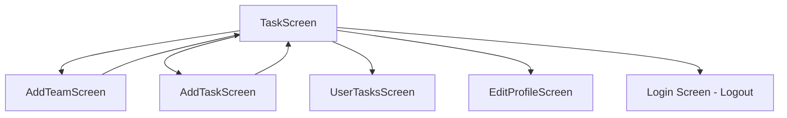

## Screen Overview

The `TaskScreen` is the primary dashboard of the application where users can view and manage their teams. It serves as the home screen after successful authentication.

**Location:** `lib/ui/screens/task_screen.dart`

## Purpose

The TaskScreen provides:
- Display of all teams the current user belongs to
- User profile information in the app bar
- Navigation to team task details
- Team creation and deletion functionality
- Quick access to user-specific tasks and profile editing

## State Management

### State Variables

<ParamField path="_currentUser" type="User?">
  The currently authenticated Firebase user. Retrieved from `FirebaseAuth.instance.currentUser`.
</ParamField>

<ParamField path="_teams" type="List<Map<String, dynamic>>">
  List of teams that the current user is a member of. Each team contains:
  - `id`: Team document ID
  - `name`: Team name
  - `members`: List of member user IDs
  - `color`: Team color (as integer)
  - `userId`: ID of the team creator
</ParamField>

<ParamField path="_isLoading" type="bool">
  Loading state indicator. Initially `true`, set to `false` after teams are fetched.
</ParamField>

### Firebase Services

- **FirebaseAuth** (`_auth`): Authentication service for current user management
- **FirebaseFirestore** (`_firestore`): Database operations for teams and users
- **FirebaseStorage** (`_storage`): Storage service for profile images
- **AuthService** (`_authService`): Custom authentication service wrapper
- **Logger** (`_logger`): Logging utility for debugging

## Key Functionality

### Initialization

On screen load (`initState`):
1. Gets the current authenticated user
2. Fetches teams where the user is a member
3. Fetches the user's profile image URL

### Fetching Teams

```dart
Future<void> _fetchTeams()
```

Retrieves all teams from Firestore and filters them to show only teams where the current user is a member. Located at `task_screen.dart:38`.

### Deleting Teams

```dart
Future<void> _deleteTeam(String? teamId)
```

Deletes a team from Firestore. Only available to team creators. Shows a confirmation dialog before deletion. Located at `task_screen.dart:66`.

### Profile Image Management

```dart
Future<String?> getProfileImageUrl()
```

Retrieves the user's profile image URL from Firebase Storage at path `profile_images/{userId}`. Located at `task_screen.dart:80`.

## User Interactions

### App Bar Actions

1. **Profile Avatar (tap)**: Navigates to `EditProfileScreen`
2. **Tasks Icon** (assignment icon): Navigates to `UserTasksScreen` showing user's assigned tasks
3. **Logout Icon**: Signs out the user and returns to login screen

### Team List Actions

<CardGroup cols={2}>
  <Card title="View Team" icon="eye">
    Opens `AddTaskScreen` with team details to view and manage tasks
  </Card>
  <Card title="Delete Team" icon="trash">
    Shows confirmation dialog and deletes team (creator only)
  </Card>
</CardGroup>

### Floating Action Button

Centered FAB that navigates to `AddTeamScreen` for creating new teams. Refreshes the team list when returning.

## Widget Tree Structure

```
Scaffold
├── AppBar
│   ├── StreamBuilder (user profile data)
│   │   ├── CircleAvatar (profile photo)
│   │   └── Column (greeting & welcome message)
│   └── Actions
│       ├── IconButton (tasks)
│       └── IconButton (logout)
├── Body
│   ├── CircularProgressIndicator (if loading)
│   ├── "No tienes equipos" (if empty)
│   └── Padding
│       └── Column
│           ├── Text ("Aquí puedes ver tus equipos:")
│           └── ListView.builder (team cards)
│               └── Card (for each team)
│                   └── ListTile
│                       ├── Title (team name)
│                       └── Trailing
│                           ├── ElevatedButton ("Ver")
│                           └── IconButton (delete)
└── FloatingActionButton (add team)
```

## Components

### Team Card

Each team is displayed as a `Card` with:
- **Background color**: Custom color from team data
- **Title**: Team name
- **"Ver" button**: Navigates to task management
- **Delete button**: Circular button with trash icon (only for creators)

### User Greeting

The app bar displays:
- Profile photo (or person icon if unavailable)
- "Hola, {userName}" greeting
- "¡Bienvenido de nuevo!" welcome message

This data is streamed in real-time from Firestore using `StreamBuilder` (located at `task_screen.dart:105`).

## Navigation Flow



## Delete Confirmation Dialog

When deleting a team, users see a custom dialog with:
- Large trash icon in a circular avatar
- Title: "¿Desea eliminar el equipo?"
- Warning: "Recuerda que el equipo eliminado, no se podrá recuperar."
- **Aceptar** button (green background): Confirms deletion
- **Cancelar** button (gray background): Cancels operation

Located at `task_screen.dart:265-402`.

## Loading States

<Steps>
  <Step title="Initial Load">
    Shows `CircularProgressIndicator` while `_isLoading` is `true`
  </Step>
  <Step title="Empty State">
    Displays "No tienes equipos." when user has no teams
  </Step>
  <Step title="Loaded State">
    Shows list of team cards with all interaction options
  </Step>
</Steps>

## Code Structure

The screen follows Flutter's StatefulWidget pattern:

- **TaskScreen** (StatefulWidget): Widget definition
- **TaskScreenState** (State): State management and business logic

Key methods are organized by functionality:
- Data fetching: `_fetchTeams()`, `_fetchTeamMembers()`
- Data operations: `_deleteTeam()`
- UI utilities: `getProfileImageUrl()`, `_fetchProfileImageUrl()`