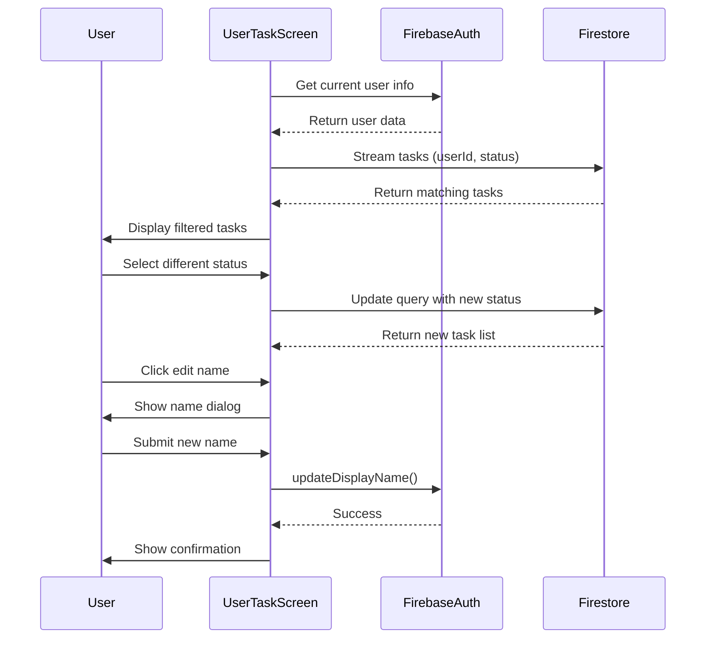

## Overview

The `UserTaskScreen` displays all tasks assigned to a specific user, with the ability to filter tasks by status and update the user's display name.

**File**: `lib/ui/screens/user_task_screen.dart`

## Purpose

Provides a personalized task view where users can:
- View all tasks assigned to them across all teams
- Filter tasks by status (No Iniciado, En desarrollo, Finalizado)
- Update their display name
- See task details and progress

## Constructor

<ParamField path="userId" type="String" required>
  The unique identifier of the user whose tasks to display
</ParamField>

```dart
const UserTasksScreen({super.key, required this.userId});
```

## Key Components

### State Variables

<ParamField path="userName" type="String">
  Display name of the current user
</ParamField>

<ParamField path="userEmail" type="String">
  Email address of the current user
</ParamField>

<ParamField path="selectedStatus" type="String">
  Currently selected status filter (default: "No Iniciado")
</ParamField>

## Key Methods

### initState()

Initializes user information from Firebase Auth:

```dart lib/ui/screens/user_task_screen.dart:20
@override
void initState() {
  super.initState();
  final User? user = FirebaseAuth.instance.currentUser;
  userName = user?.displayName ?? 'Usuario sin nombre';
  userEmail = user?.email ?? 'sucorreo@gmail.com';
}
```

### updateUserName()

Updates the user's display name in Firebase Auth:

```dart lib/ui/screens/user_task_screen.dart:27
void updateUserName(String newName) async {
  User? user = FirebaseAuth.instance.currentUser;

  if (user != null) {
    await user.updateDisplayName(newName);
    await user.reload();
    setState(() {
      userName = newName;
    });
    ScaffoldMessenger.of(context).showSnackBar(
      SnackBar(content: Text('Nombre actualizado a: $newName')),
    );
  }
}
```

### showUpdateNameDialog()

Displays a dialog for updating the user's name:

```dart lib/ui/screens/user_task_screen.dart:43
void showUpdateNameDialog() {
  TextEditingController nameController = TextEditingController();

  showDialog(
    context: context,
    builder: (context) => AlertDialog(
      shape: RoundedRectangleBorder(
        borderRadius: BorderRadius.circular(20),
      ),
      title: const Center(
        child: Text(
          'Actualizar Nombre',
          style: TextStyle(
            fontWeight: FontWeight.bold,
            fontSize: 20,
          ),
        ),
      ),
      content: TextField(
        controller: nameController,
        decoration: InputDecoration(
          hintText: 'Introduce tu nombre',
          filled: true,
          fillColor: Colors.grey[200],
          border: OutlineInputBorder(
            borderRadius: BorderRadius.circular(15),
            borderSide: BorderSide.none,
          ),
        ),
      ),
      actions: [
        TextButton(
          onPressed: () => Navigator.pop(context),
          child: const Text('Cancelar'),
        ),
        ElevatedButton(
          onPressed: () {
            updateUserName(nameController.text);
            Navigator.pop(context);
          },
          child: const Text('Guardar'),
        ),
      ],
    ),
  );
}
```

## UI Structure

### AppBar

- **Title**: "Mis Tareas" (My Tasks)
- **Back Button**: Returns to previous screen
- **Edit Name Action**: IconButton to show name update dialog

### Status Filter

Chip-based filter buttons:
- **No Iniciado** (Not Started) - Red chip
- **En desarrollo** (In Progress) - Orange chip
- **Finalizado** (Completed) - Green chip

### Task List

StreamBuilder displaying filtered tasks:
- Shows tasks assigned to the user with selected status
- Real-time updates via Firestore snapshots
- Empty state message when no tasks match filter

## Firestore Query

Tasks are queried with compound filters:

```dart
Stream<QuerySnapshot> tasksStream = FirebaseFirestore.instance
    .collection('tasks')
    .where('responsibleId', isEqualTo: widget.userId)
    .where('status', isEqualTo: selectedStatus)
    .snapshots();
```

### Query Conditions

1. **responsibleId**: Matches the provided userId parameter
2. **status**: Matches the currently selected status filter

## Task Status Values

<ResponseField name="No Iniciado" type="string">
  Task has not been started yet (red indicator)
</ResponseField>

<ResponseField name="En desarrollo" type="string">
  Task is currently in progress (orange indicator)
</ResponseField>

<ResponseField name="Finalizado" type="string">
  Task has been completed (green indicator)
</ResponseField>

## Data Flow



## Task Display

Each task ListTile shows:
- **Title**: Task name
- **Subtitle**: Task description
- **Status Icon**: Visual indicator based on status
  - Red pending icon for "No Iniciado"
  - Orange clock for "En desarrollo"
  - Green check for "Finalizado"

## Navigation

Accessed from:
- TaskScreen AppBar action button (assignment icon)
- Shows tasks for the current logged-in user

## Best Practices

1. **Use Streams**: Real-time updates via StreamBuilder
2. **Index Queries**: Ensure Firestore has composite index for userId + status
3. **Handle Empty States**: Show meaningful message when no tasks
4. **Validate Name**: Check non-empty before updating display name
5. **User Feedback**: Show SnackBar confirmations for actions

## Performance Considerations

### Firestore Indexing

Required composite index:

```
Collection: tasks
Fields indexed:
  - responsibleId (Ascending)
  - status (Ascending)
```

### Query Efficiency

- Filters applied at database level
- Only matching documents returned
- Real-time listener updates automatically
- Consider pagination for large task lists

## Error Handling

- **User Not Found**: Falls back to default names
- **Stream Errors**: Handled by StreamBuilder
- **Update Failures**: Display error SnackBar
- **Empty Name**: Validate before updating

## Related Components

<CardGroup cols={2}>
  <Card title="TaskScreen" icon="list" href="/api/task-screen">
    Main dashboard linking to user tasks
  </Card>
  <Card title="Task Management" icon="tasks" href="/features/task-management">
    Task management feature overview
  </Card>
  <Card title="AddTaskScreen" icon="plus" href="/api/add-task-screen">
    Screen for creating and editing tasks
  </Card>
  <Card title="User Profiles" icon="user" href="/features/user-profiles">
    User profile management
  </Card>
</CardGroup>
